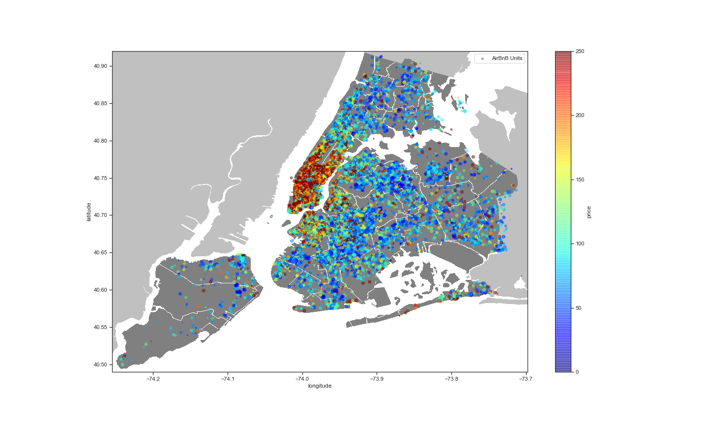

# New York City Airbnb Open Data - Practice

**Attribution**: *Hands-On Machine Learning with Scikit-Learn, Keras, and TensorFlow*, 2nd Edition, by Aurelien Geron (O'Reilly). Copyright 2019 Kiwisoft S.A.S, 978-1-492-03264-9 

Machine Learning Practice. Implimenting the project following the Chapter-2 project on O'REILLY's Hands-On Machine Learning.  

**Goal**: Predict the unit price for a Airbnb post, given all the other metrics. Predict NYC Airbnb Rental Prices 
**Approach**:
<ol>
    <li>Supervised Learning task, because given labeled traning examples (each instance comes with expected output, i.e. unit's price).</li>
    <li>Regression task, since we need to predict a value.</li>
    <li>Multiple regression problem since the system will use multiple features to make a prediction.</li>
    <li>Univariate regression problem since we are only trying to predict a single value for each unit.</li>
    <li>There is no continuous flow of data, no need to adjust to changing data, and the data is small enough to fit in memmory: Batch Learning</li>
</ol>

**Possible Performance Measure:** Root Mean Square Error (RMSE), and Mean Absolute Error (MAE).<b>
    
**Data:** [New York City Airbnb Open Data | Kaggle](https://www.kaggle.com/dgomonov/new-york-city-airbnb-open-data)
    
**Project Author:** Maksim Ekin Eren